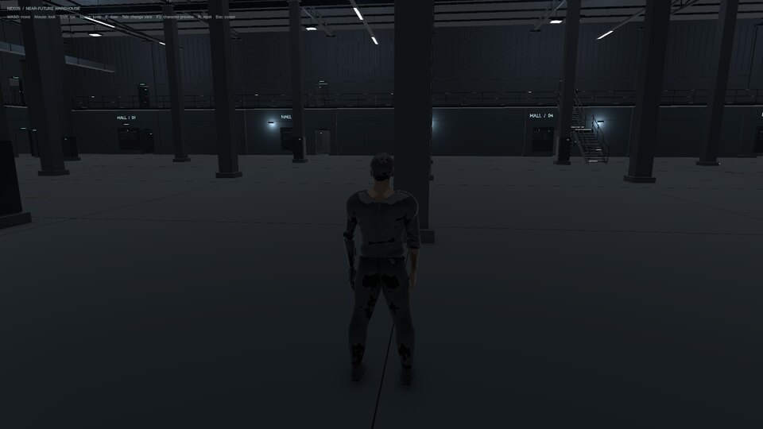

# Guided tour: the game as it is today

A hands-on walk through the editor and the code, about 40 minutes. Nothing
here changes a file: everything you try happens in Play mode and is undone
when you stop. Read [[guide/01-unity-in-this-project]] first if words like
*component* or *prefab* are new.

Keep the reference notes open alongside: [[architecture/project-map]] for
where things are, and the notes under `systems/` for the details.

## 0. Before you start (2 min)

1. Open the project in Unity Hub with Unity **6000.6.2f1**.
2. In the **Project** window open `Assets/Scenes/MainTest`.
3. Arrange the windows so you can see Hierarchy, Scene or Game, Inspector,
   Project and Console at once.
4. If the scene name in the Hierarchy shows a `*` although you changed
   nothing, that is URP adding helper components on its own. Whenever Unity
   asks whether to save `MainTest`, answer **Don't Save** for now.

## 1. Play it (4 min)

Press **Play** (the triangle at the top), then click once inside the Game
view so it receives the keyboard.

You start in **third person**, behind NEXUS, in the main hall, facing the
hall's south wall. The top-left text lists the keys.

| Try | Expect |
| --- | --- |
| W A S D, mouse | walk and look; the body turns to face where it walks |
| hold Left Shift | run |
| S only | the body turns around and walks toward the camera |
| Space | a small jump (0.66 m) |
| Tab, then look down | first person: you see your chest, boots and raised arms |
| R | back to the start |
| Esc | frees the mouse cursor; click the Game view to capture it again |
| F1 | the character preview scene; F1 again returns |



**The first door.** Ahead and a little to the left, about 6 m away, is a
door in the south wall: `DOOR_Hall_X-18_4`. Switch to first person (Tab),
walk to within 3 m, look at the door and press **E**: it swings open and the
screen says "Access granted". Press E again and it closes ("Door closed").
Now press Tab for third person and try E from a step away: nothing happens
until you touch the door.

That last part is a bug; [[systems/doors-and-interaction]] explains it.
(Until the art update of 2026-10-02 this door stood open at the start, and
the first E closed it.) Press **Play** again to stop.

## 2. The Hierarchy (5 min)

The Hierarchy has two top-level objects:

- `Warehouse_NearFuture`, with three children: `Warehouse_NearFuture_Geometry`
  (everything you see), `Static_Collision` (invisible walls for physics) and
  `Facility_Lighting` (106 lamps).
- `NEXUS_Player`, with `NEXUS_Character` (the body) and `Player_Camera`.

Try the search box at the top of the Hierarchy:

| Type | Shows |
| --- | --- |
| `DOOR_Hall` | the hall doors (leaves and frames) |
| `t:NexusDoor` | the 119 objects that have the door script |
| `t:Light` | the lamps |
| `FLOOR_` | one floor object per room; compare with the floor plan in [[systems/level-warehouse]] |

Clear the search, select `DOOR_Entry_Main`, move the mouse over the Scene
view and press **F**: the view flies to the building's main entrance.

## 3. The player in the Inspector (6 min)

Select `NEXUS_Player`. Read the Inspector from top to bottom:

1. **Transform**: position (0, 0.03, 12), the start point.
2. **Character Controller**: the capsule. Height 1.78, Radius 0.26, Step
   Offset 0.32 (how high a step it climbs without jumping).
3. **Nexus Player (Script)**: our script. Click inside the View Camera
   field: the Hierarchy highlights `Player_Camera`. That link lives in the
   scene file, not in the code.

Look at the **Layer** box at the top of the Inspector: the player sits on
layer **Player**. Further down, Nexus Player has **Camera Collision Layers**
(World) and **Interaction Layers** (everything except Player): they decide
what the camera treats as walls and what the E ray can hit.

**Try it in Play mode:**

- Set **Walk Speed** to 5 and walk. Stop Play: the value is back to 1.65.
- Tick **First Person** and look down: your chest and boots, but no arms.
  Untick it, press **Tab** and look down again: now the arms are raised.
  The checkbox only changes one field. The Tab key calls the method
  `SetView()`, which also switches on the arm animation layer and hides the
  head. Changing a field is not the same as calling the method that goes
  with it; the code has to be written so that both stay in step.

## 4. From the Inspector into the code (10 min)

In the Nexus Player component, double-click the greyed-out **Script** field.
`NexusPlayer.cs` opens in your code editor (Rider, if it is set under
Edit > Preferences > External Tools).

The lines are dense (several statements per line). Read it in this order,
with [[systems/player]] open next to it:

| Lines | Part | Question to answer while reading |
| --- | --- | --- |
| 10–32 | the fields | which ones appear in the Inspector, and why? |
| 36–45 | `Awake()` | what does the script look up once, at the start? |
| 60–72 | `Update()` | which line reads each key from the table in step 1? |
| 73–85 | `Simulate()` | where does the player actually move? |
| 87–98 | `LateUpdate()` | why is the camera placed here and not in `Update()`? |
| 99–103 | `Interact()` | why does E only work on doors? |
| 104–111 | `OnGUI()` | where does "Access granted" come from? |
| 112–143 | auto-test | who starts it, and where does it save its files? |

Then open `NexusDoor.cs` (16 lines) and read all of it. The comments in
[[systems/doors-and-interaction]] walk through it.

## 5. The camera (3 min)

Select `Player_Camera`. The Camera component says Field of View 60. Press
Play and look at the same field: it now reads 53, or 75 after Tab. Drag the
slider: it snaps back at once. `LateUpdate()` overwrites the camera's
position, rotation and field of view every frame, so Inspector changes do
not stick. See [[systems/camera]].

## 6. Animation (5 min)

1. Expand `NEXUS_Player/NEXUS_Character` and select `LOD0`. It has the
   **Animator**; `LOD1` to `LOD3` do not.
2. Open **Window > Animation > Animator**. You see one state, `Locomotion`.
   Double-click it to open the blend tree: idle, walk, jog.
3. Press Play and walk. In the Animator window's **Parameters** tab, `Speed`
   moves between 0, 1.65 and 3.25.
4. Open the **Layers** tab. The second layer, "First Person Arms", holds the
   raised-arms pose; its weight is 0, and the script turns it up to 1 when
   you press Tab.

See [[systems/character-and-animation]].

## 7. A door up close (3 min)

Search `DOOR_Hall_X-18_4` and select it. It has **Nexus Door (Script)**
(Loading Door off, Angle 95, Lift 3.8) and a **Box Collider**.

Press Play, set **Angle** to 160 and press E at the door: it swings much
further. Stop Play and the angle is 95 again.

## 8. Assets (3 min)

In the **Project** window (set the search scope to **In Assets**, or the
results include every package):

| Search | Finds |
| --- | --- |
| `t:Prefab` | four prefabs: three NEXUS ones and the main menu's service bay; `NEXUS_Player` and the arms-only model are not used by any scene yet |
| `t:Scene` | the three scenes |
| `t:Script` | the two gameplay scripts in `Assets/Scripts/`, and the main menu prototype's scripts under `Assets/NETRunner/MainMenu/` |
| `t:AnimatorController` | `NEXUS_Locomotion` |

Right-click `NexusDoor` in the Project window and choose **Find References
In Scene**: the Hierarchy filters down to the 119 doors.

## 9. From the terminal (2 min)

With the editor open, in the repository folder:

```bash
bin/unity-inspect player             # the player's components and values
bin/unity-inspect doors              # which doors are exported open or shut
unity command find_gameobjects --name DOOR_Entry_Main
bin/unity-shot mytest                # screenshot of the Game view into Logs/shots/
```

## Check yourself

1. Where is the code that moves the camera, and why is it in that method?

   > Answer: `NexusPlayer.LateUpdate()`, lines 87–98. `LateUpdate` runs after
   > all movement and animation of the frame, so the camera follows the body
   > without lagging a frame behind.

2. You change Walk Speed on the `NEXUS_Player.prefab` asset. Why does
   nothing change when you play `MainTest`?

   > Answer: the player in `MainTest` is a separate copy, not an instance of
   > that prefab. Only instances follow the prefab.

3. Why is Player left out of the Interaction Layers field?

   > Answer: the E ray starts at the camera. In third person it passes
   > through the player's body; in first person it starts right at the head.
   > If the Player layer were not left out, the first thing it hit would be
   > the player.

4. Why does E not open a door from a step away in third person?

   > Answer: the ray starts at the camera, 3.17 m behind the player, and is
   > only 3.5 m long, so it ends about 0.3 m past the player's body.

5. Why did the first door close when the screen said "Access granted"?

   > Answer: the script treats the pose from the model file as "closed", but
   > that door was exported standing open. Toggling turns it 95° and marks it
   > "open", which here means shut.
   > The 2026-10-02 warehouse art revision corrects this: all doors are
   > exported closed, so the first toggle opens them. The question above
   > describes the earlier export.

6. Where is the setting that decides which scene a built game opens first,
   and what is wrong with it?

   > Answer: File > Build Profiles > Scene List. The empty `SampleScene` is
   > first, so the built game shows only sky.

7. Which object has the Animator, and why does that matter for LOD1–3?

   > Answer: `NEXUS_Character/LOD0`. The other detail levels have their own
   > skeletons without an Animator, so they would stand frozen if they were
   > ever shown.

8. You tick First Person in the Inspector during Play. What is different
   from pressing Tab?

   > Answer: only the camera moves. `SetView()`, which Tab calls, also
   > raises the arms, forces LOD0 and hides the head.

Next: [[architecture/before-new-scripts]], the list of what to change before
adding new scripts.
