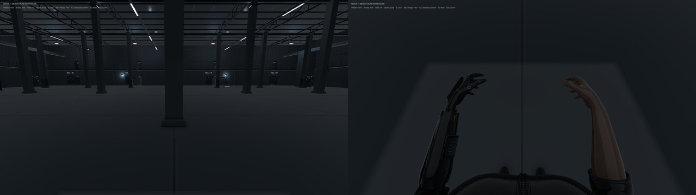

# Camera

**Purpose.** The legacy gameplay camera. It shows the world either from the
player's eyes (first person) or from behind the player (third person).

**Status.** Works. Its position is recalculated in code every frame, so most
camera settings you change in the Inspector are overwritten. Post-processing
and anti-aliasing are off.

Verified 2026-09-30 on commit `df3a31d` with `bin/unity-inspect player` and
scripted Play-mode checks.




## Where it lives

| What | Where |
| --- | --- |
| Object | `MainTest` → `NEXUS_Player/Player_Camera` (same name in `CharacterPreview` and in `NEXUS_Player.prefab`) |
| Placement code | `NexusPlayer.LateUpdate()`, [`Assets/Scripts/NexusPlayer.cs`](../../Assets/Scripts/NexusPlayer.cs) lines 87–98 |
| View switching | `NexusPlayer.SetView()`, lines 48–59, called by the Tab key |
| Look angles | `yaw` (left/right) and `pitch` (up/down), updated from the mouse in `Update()`, line 69 |

The legacy player has no separate camera script or Cinemachine. The independent
menu uses four surveillance cameras, with only one enabled at a time; see
[[systems/main-menu]].

## How the camera is placed

`LateUpdate` runs after all movement of the frame, so the camera never lags a
frame behind the body.

**First person** (line 91)

```
camera position = player position + 1.66 m up + 0.17 m forward
camera rotation = pitch (up/down), yaw (left/right)
field of view   = 75°
```

The eye point is fixed to the capsule, not to the head bone, so the view
does not bob with the walk animation. The capsule is 1.78 m tall; the eyes
sit at 1.66 m.

**Third person** (lines 94–96)

```
focus point     = player position + 1.34 m up         (about chest height)
wanted offset   = 0.36 m right, 0.14 m up, 3.15 m back, turned by pitch and yaw
                  → 3.17 m from the focus point
wall check      = a sphere of radius 0.14 m is swept from the focus point
                  toward the camera, hitting only the Camera Collision Layers (World);
                  if it hits, the camera moves in to (hit distance − 0.08 m),
                  but never closer than 0.45 m
camera          = placed on that line, then turned to look at the focus point
field of view   = 53°
```

Measured at the start position: the camera stands 3.17 m from the focus
point and about 1.9 m above the floor.

## What Tab changes

`SetView(true)` does three things besides moving the camera:

| Change | First person | Third person |
| --- | --- | --- |
| Animator layer "First Person Arms" | weight 1: arms raised in a ready pose | weight 0 |
| LOD group | forced to the full-detail model (LOD0) | automatic |
| Head, hair, eyes, eyebrows (38 renderers across the four LODs) | not drawn, still cast shadows | drawn |

The head parts are found by **name**: any renderer whose name contains
`Head_Neck`, `Hair_`, `Eyebrow`, `Eyeball`, `_Eye`, `Iris` or `Pupil`. If the
model is re-exported with other names, the head will show in first person.

In first person you see your own body and arms only when looking down (see
the right half of the first picture). Looking straight ahead, no part of the
body is on screen.

## Camera component settings

| Setting | Value | Note |
| --- | --- | --- |
| Tag | `MainCamera` | makes `Camera.main` find it; the script uses a direct reference instead |
| Field of View | 60 in the Inspector | ignored: the script sets 75 or 53 every frame |
| Clipping Planes | near 0.035 m, far 220 m | the near plane is small so the body is not cut off in first person |
| Background | solid dark blue-grey (0.025, 0.035, 0.047) | there is no sky in this scene |
| Culling Mask | everything | |
| HDR | on | |
| **Post Processing** (URP camera setting) | **off** | the project's bloom, tonemapping and vignette are never applied |
| **Anti-aliasing** (URP) | **none** | edges look jagged |
| Render Shadows | on | |
| AudioListener | on this object | the "ears" of the game follow the camera |

## Known problems

- Field of view, position and rotation cannot be tuned in the Inspector; the
  code overwrites them every frame. Measured: forcing the FOV to 20 from
  outside was back at 75 one frame later.
- Interaction (E) casts from the camera, so in third person it reaches only
  about 0.3 m past the player's body. See [[systems/doors-and-interaction]].
- No smoothing: the third-person camera snaps when it hits a wall.
- Post-processing and anti-aliasing are off, which is part of why the scene
  looks flat and dark; see [[systems/rendering]].
- The camera logic lives inside the player script, so any new camera
  behaviour (aiming, cutscenes, hacking view) has to be added there.

## Recorded design direction (2026-10-02)

AdaM404 specified first person as the default gameplay perspective and third
person only for debugging in issue #13. Issue #14 records keeping the full body
for now and retaining the unused arms-only prefab for possible later needs.
See [[design/README]] for the source comments and agreement status. These are
design instructions; the legacy Tab switch and serialized scene defaults have
not been changed by this documentation update.
