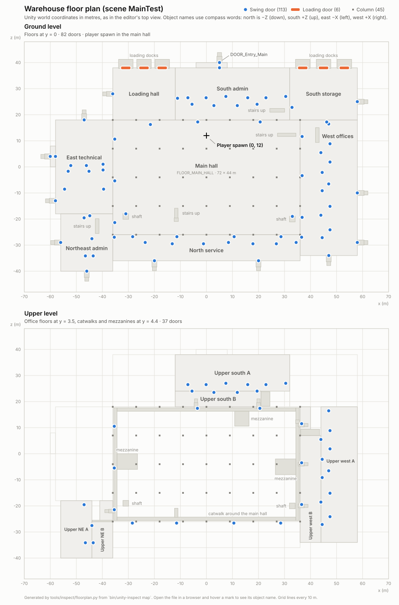

# Level: the near-future warehouse (scene `MainTest`)

**Purpose.** The only playable space: a two-storey warehouse complex with a
large hall, offices, technical rooms, loading docks and a yard.

**Status.** Complete as a model, with working collision and 106 lights. It is
set up only inside the `MainTest` scene file; there is no warehouse prefab,
no navigation data for enemies and no baked lighting.

The 2026-10-02 art revision closes all 119 doors and includes the editable
Blender source under `ArtSource/Warehouse_NearFuture`. The 71 previously
open leaves and their skins are repositioned; the building geometry,
object names, door hierarchy and Unity metadata are preserved. Review
images and export checks are included with the source package.

Verified 2026-09-30 on commit `df3a31d` with `bin/unity-inspect scene
environment map` in the open editor.



## Where it lives

| What | Where |
| --- | --- |
| Prefab | `Assets/Environment/Warehouse_NearFuture/Warehouse_NearFuture.prefab` (2 MB): geometry, collision, doors and lights together |
| Scenes | `Assets/Scenes/Game/Warehouse.unity` (the gameplay scene, first in the build list) and `Assets/Scenes/MainTest.unity` (AdaM404's preview); both place the prefab |
| Visual model | `Assets/Environment/Warehouse_NearFuture/Models/Warehouse_NearFuture_Geometry.fbx` |
| Collision model | `Assets/Environment/Warehouse_NearFuture/Models/Warehouse_NearFuture_Collision.fbx` |
| Textures | `Assets/Environment/Warehouse_NearFuture/Textures/` (29 images) |
| Materials | `Assets/Materials/Environment/` (27 materials, URP Lit) |
| Source notes | [`Assets/Documentation/Environment_Source.md`](../../Assets/Documentation/Environment_Source.md) and `EnvironmentMetadata.json` next to the models |

These are art assets owned by AdaM404 (see [[assets/handoff]]).

## Scene structure

The gameplay scene and `MainTest` each hold 3,080 objects under two roots:

```
Warehouse_NearFuture                 instance of Warehouse_NearFuture.prefab, 2,647 objects
├─ Warehouse_NearFuture_Geometry     the visual model: 1,827 meshes, 1,078,212 triangles
│    ├─ 119 DOOR_* leaves              + NexusDoor + BoxCollider, stored in the prefab
│    └─ everything else you see
├─ Static_Collision                  the collision model: 710 invisible shapes
│    └─ 704 COL_* objects              + MeshCollider, stored in the prefab
└─ Facility_Lighting                 106 point lights, stored in the prefab
NEXUS_Player                         the player, see [[systems/player]]
```

Since 2026-10-04 ([#8](https://github.com/AdaM404-dev/NET.runner-92/issues/8)) everything above `NEXUS_Player` lives in the
warehouse **prefab**; before, it existed only inside `MainTest.unity`. Scene-wide
settings (fog, ambient light, reflections) are not part of a prefab: the
gameplay scene has copies of `MainTest`'s values.

The two models are **instances of the imported FBX files**. Everything added
on top of them (door scripts, colliders) is stored in `MainTest.unity` as a
change to those instances. If the model files are re-exported with different
object names, those additions can silently detach.

The level was assembled by the teammate's tools; the script that did it is
not in the repository. `EnvironmentMetadata.json` lists the same 27
materials, 108 Blender lights, 1,827 object anchors and 232 door parts.

## Size and directions

| Measure | Value |
| --- | --- |
| Whole site, including the asphalt yard | 174 × 134 m |
| Building footprint | 118 × 80 m |
| Main hall | 72 × 44 m, roof at about 12 m |
| Upper floors | floor at y = 3.5 m; catwalks and mezzanines at y = 4.4 m |
| Player start | x = 0, z = 12, in the main hall, facing +Z |

Unity uses **x** (left–right), **y** (up) and **z** (forward–back), in metres.
Object names use compass words that map to Unity like this:

| Word in names | Unity direction | On the floor plan |
| --- | --- | --- |
| North | −Z | down |
| South | +Z | up |
| East | −X | left |
| West | +X | right |

**Numbers in object names are Blender coordinates**, and both horizontal
signs flip in Unity. For example `DOOR_Hall_Y-36_4` is the door on the wall
at Blender X = −36, near Blender Y = 4; in Unity it stands at x = 36,
z = −3.2. `STR_Column_A_00_00` and similar names count grid positions.

## Areas

Each area has a floor object named `FLOOR_…`. Type the name into the
Hierarchy search to find it.

| Area | Floor object | Centre (x, z) | Size (m) | Level |
| --- | --- | --- | --- | --- |
| Main hall | `FLOOR_MAIN_HALL` | (0, −4) | 72 × 44 | ground |
| North service | `FLOOR_NORTH_SERVICE` | (0, −31) | 72 × 10 | ground |
| South admin | `FLOOR_SOUTH_ADMIN` | (10, 28) | 44 × 20 | ground |
| South storage | `FLOOR_SOUTH_STORAGE` | (45, 28) | 26 × 20 | ground |
| Loading hall | `FLOOR_LOADING_HALL` | (−24, 28) | 24 × 20 | ground |
| Entry vestibule | `FLOOR_ENTRY_VESTIBULE` | (2, 39) | 12 × 2 | ground |
| West offices | `FLOOR_WEST_OFFICES` | (47, −8) | 22 × 52 | ground |
| East technical | `FLOOR_EAST_TECHNICAL` | (−47, 0) | 22 × 36 | ground |
| East access | `FLOOR_EAST_ACCESS` | (−59, 4) | 2 × 8 | ground |
| Northeast admin | `FLOOR_NORTHEAST_ADMIN` | (−46, −29) | 20 × 22 | ground |
| Upper south A / B | `FLOOR_Upper_SouthA`, `…SouthB` | (10, 31), (4.5, 21) | 44 × 14, 33 × 6 | upper |
| Upper west A / B | `FLOOR_Upper_WestA`, `…WestB` | (51, −8), (40, −13.5) | 14 × 52, 8 × 41 | upper |
| Upper northeast A / B | `FLOOR_Upper_NEA`, `…NEB` | (−50, −29), (−40, −33) | 12 × 22, 8 × 14 | upper |

Also: catwalks on all four sides of the main hall, three mezzanines, two
vertical shafts (at x = 33, z = −20 and x = −31, z = −19), six loading docks
on the south side, 25 stairs and steps, and 45 columns on a 9 × 11 m grid.

## What the object names mean

Every object in the visual model starts with a prefix. Counts are for
`Warehouse_NearFuture_Geometry`.

| Prefix | Count | What it is |
| --- | ---: | --- |
| `ARCH_` | 273 | walls and partitions |
| `STR_` | 56 | structure: columns and beams |
| `ROOF_` | 211 | roof panels (about 12 m up) |
| `SKY_` | 72 | small flat panels in the roof, most likely skylights |
| `CEILING_` | 5 | office ceilings |
| `WIN_` | 56 | windows (frame and glass) |
| `DOOR_` | 232 | 119 door leaves (with scripts) and 113 frames |
| `FLOOR_`, `GROUND_`, `SITE_`, `DRAIN_` | 28 | floors, floor markings, the yard, drains |
| `STAIR_`, `LANDING_`, `CATWALK_`, `RAIL_`, `MEZZ_`, `THRESHOLD_`, `SERVICE_` | 102 | ways up and walkways |
| `SHAFT_`, `VENT_`, `DOCK_`, `PANEL_` | 21 | shafts, roof vents, dock assemblies, technical panels |
| `LIGHT_…_Fixture` | 90 | the lamp housings (the light itself is a separate object) |
| `NF_` | 437 | the "near-future" upgrade layer: 113 door lock headers (`NF_MAGLOCK`), 125 wall panels and access readers (`NF_PANEL`), 47 LED strips, façade panels, signs, security sensors, dock and stair markings |

In `Static_Collision` every object starts with `COL_` followed by the name of
the visual object it stands in for, for example `COL_ARCH_Admin_Loading`.

## Collision

| Fact | Value |
| --- | --- |
| Colliders | 704 MeshColliders, not convex (they follow the exact shape) |
| Visible | no: their renderers are switched off |
| Triangles | 40,680 in total, much simpler than the 1.08 million visible ones |
| Without a collider | 6 helper objects (`COL_ARCH_Hall_DoorLevel_*`, `COL_SERVICE_East_Door_*`), so they do not block anything |
| Door leaves | have their own BoxCollider, see [[systems/doors-and-interaction]] |
| Layer | 9, like the rest of the warehouse |

To see a collider, select a `COL_…` object and switch its Mesh Renderer on in
the Inspector during Play mode; the change is undone when Play mode stops.

## Lighting and atmosphere

| Group (object names) | Count | Range | Intensity |
| --- | ---: | ---: | ---: |
| `LIGHT_Highbay_*` (main hall) | 12 | 18 m | 5 |
| `LIGHT_Moon_Soft` (blue fill) | 1 | 18 m | 5 |
| `LIGHT_Dock_*`, `LIGHT_LoadingInterior_*` | 10 | 13 m | 2.37 |
| `LIGHT_Exterior_*` | 5 | 13 m | 1.66 |
| `NF_LIGHT_Linear_*` | 15 | 8 m | 1 |
| `LIGHT_HallWall_*` | 10 | 8 m | 0.83 |
| `LIGHT_Tech_*` | 9 | 8 m | 0.63 |
| room lights (`Maint`, `NE`, `North_Service`, `South`, `Technical`, `West`) | 44 | 8 m | 0.6 |

All 106 are **point lights**, calculated live every frame (realtime), cool
white, and **none casts shadows**. There is no sun: `LIGHT_Moon_Soft` is a
point light too.

| Scene setting | Value |
| --- | --- |
| Sky | none; the camera clears to a dark colour |
| Ambient light | three-colour gradient from 0.25/0.30/0.35 (above) to near black (below) |
| Fog | on, exponential squared, density 0.006, dark blue-grey |
| Reflections | a fixed cubemap, `Assets/Materials/NEXUS_NeutralReflection.cubemap`, at 70 % |
| Baked lighting, light probes, reflection probes | none |
| Occlusion culling data | none (the objects are marked for it, but it was never baked) |
| Navigation mesh | none |

How this looks and performs is covered in [[systems/rendering]].

## Layers and static flags

| Layer | Objects | Used for |
| --- | ---: | --- |
| 9 `World` | 2,540 | everything in the warehouse; the camera's wall check hits only this layer |
| 8 `Player` | 432 | the player; the interaction ray ignores it |
| 0 Default | 108 | the lights and the camera |

1,589 objects are marked **static** (Occluder, Occludee, Batching): the
parts that never move. Doors, colliders and lights are not.

## Other scenes

- **`CharacterPreview`**: a 12 × 12 m stage (`Preview_Stage`, layer 9 World), three
  point lights *with* soft shadows, no fog, and the player setup as
  `Character_Preview` with Preview Mode on. F1 switches between the two scenes.
- **`Game/Warehouse`**: the gameplay scene, first in the build list. It holds
  only the warehouse prefab and the player prefab; gameplay objects are added
  here, not in `MainTest`.
- Unity's empty `SampleScene` was deleted on 2026-10-04.

## Known problems

- Door scripts and colliders are still attached to objects inside the
  imported models (now inside the prefab). A re-export that renames objects
  can detach them.
- No navigation mesh yet: enemies such as the K7 cannot find paths.
- 106 realtime lights without shadows and nothing baked: flat, dark lighting.
- Occlusion flags are set but the occlusion data was never generated.

## Open questions

- Is this warehouse the first playable level, or a test space?
- Which doors, panels and rooms matter for the first mission?
