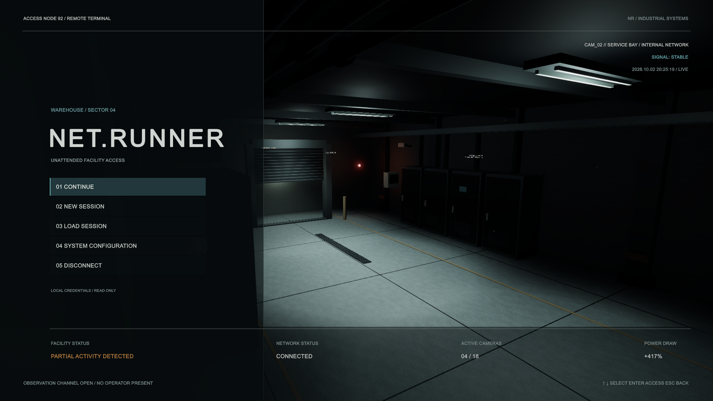
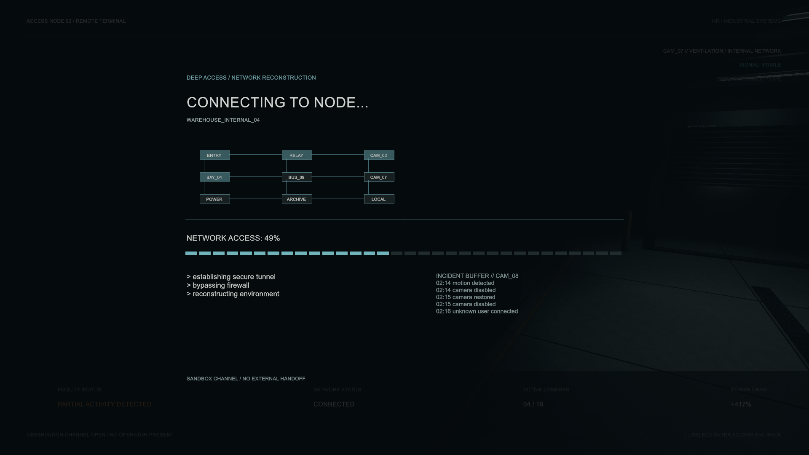

# Standalone main menu and loading prototype

## Purpose

An independent surveillance terminal for reviewing the game's menu atmosphere
and simulated network access. Merged into main on 2026-10-02 in
[PR #22](https://github.com/AdaM404-dev/NET.runner-92/pull/22).

## Status

The prototype is complete. It has no gameplay, save or real network integration.
Continue and New Session run a simulated transfer and return to observation.
It is absent from Build Settings; the startup scene is the gameplay scene `Game/Warehouse`.

## Where it lives

| What | Path under `Assets/NETRunner/MainMenu/` |
| --- | --- |
| Scene | `Scenes/NETRunner_MainMenu_Prototype.unity` |
| Runtime | `Scripts/` (`NetRunner.MenuPrototype` assembly) |
| Timing, colors, text, facility data | `UI/MenuPrototypeSettings.asset` |
| UI presentation | `UI/MenuTerminal.uss` |
| Grading and effects | `VFX/SurveillanceVolume.asset` |
| Reproducible builder | `Editor/MenuPrototypeBuilder.cs` |
| Tests | `Tests/PlayMode/MenuPrototypeTests.cs` |

Open the scene directly in Unity 6000.6.2f1 and press Play. Enter skips the
roughly five-second boot. Mouse or Tab/arrow keys and Enter navigate; Escape
closes a modal and restores focus. Disconnect requires confirmation: in the
editor it returns to the terminal; a player build quits.

## How it works

- MainMenuController manages state; MenuView presents UI Toolkit panels;
  MenuBootSequence handles startup and skip.
- SurveillanceCameraController cycles CAM_02, CAM_04, CAM_07 and CAM_11
  every 18–27 seconds, with one enabled camera and a short signal break.
- FacilityEventController schedules relay, machinery and shutter effects;
  opportunities occur every 38–62 seconds with 75% probability. Scheduling
  pauses during boot/loading, while active events restore their own state.
- LoadingScreenController and SystemLogController show the node map,
  segmented progress and sequential records, then return to the same scene.
- MenuAudioController manages five locally synthesized placeholder clips.
  Settings affect ambience, attenuation and camera cycling for this session.

The environment is original primitive geometry with URP materials and a
scene-local volume. Runtime, editor and test code have separate assemblies.
Its folder, `Assets/NETRunner/MainMenu/`, was the model for the feature
folders the gameplay code moved into on 2026-10-04 ([[architecture/overview]]);
the menu itself does not use the gameplay assemblies.

## Tuning and rebuilding

Use the settings asset, USS, scene controller references and event targets.
See the [asset guide](../../Assets/NETRunner/MainMenu/README.md) for responsibilities
and Inspector controls. **NET.runner > Menu Prototype > Create or rebuild
standalone scene** replaces the prototype scene, so preserve manual edits
before rebuilding. The builder retains existing configuration/media assets,
refuses unsaved current scenes, and does not change Build Settings.

## Verification

Repository paths, guides and merge status checked on 2026-10-03 against main
at `c9d65e8`. Runtime evidence below is the recorded October 2 validation,
not a new Unity run:

- Unity 6000.6.2f1 Windows import/compile; two PlayMode tests passed, zero failed.
- Tests cover boot/skip, focus/submit, modals, settings, both transfers,
  duplicate clicks, event restoration, camera cycling and scene-unload cleanup.
- Reference audit: zero missing components/materials, four cameras with one
  enabled, nine lights, five AudioSources, 4,820 mesh triangles.
- Six 1920 × 1080 screenshots reviewed. Reports and images are in
  `docs/img/menu-prototype/`; [progress record](../../MAIN_MENU_PROGRESS.md)
  links every review artifact.

## Known problems and open questions

- Archive is a placeholder; settings do not persist; there are no save slots,
  actual asynchronous scene loads or story-state binding.
- Authored audio, final art/fonts, localization and rebinding remain future work.
- Desktop landscape layout only; no standalone build or manual gamepad check
  is recorded. Behavior outside the isolated scene is untested.
- Integrating this menu into startup/gameplay needs a separately scoped task.
